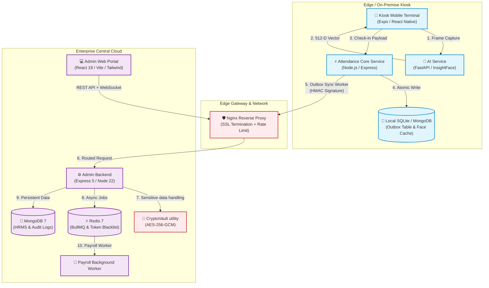

# 🏢 EmployeeManagement & Biometric Edge Kiosk

<div align="center">


<p align="center">
  <b>An Enterprise-Grade, Distributed Human Resource Management System (HRMS) & Biometric Edge Attendance Platform.</b><br/>
  Featuring Edge Kiosks, InsightFace Vector Embeddings, Transactional Outbox Delivery, and an AES-256-GCM utility for sensitive data.
</p>

[Key Innovations](#-key-architectural-innovations) •
[Architecture](#-system-architecture) •
[Tech Stack](#-tech-stack-matrix) •
[Quickstart](#-quick-start) •
[Testing & QA](#-testing--quality-assurance) •
[Runbooks & Compliance](#-compliance--enterprise-runbooks)

---

</div>

## 🌟 Executive Summary

**EmployeeManagement** is not just another CRUD human resource tool; it is a full-scale, distributed production platform designed to bridge physical workplace terminals with enterprise-grade cloud management.

Built to address network instability, the platform provides biometric check-ins on Android edge kiosks with retryable event delivery via a transactional outbox, alongside a Vietnamese payroll calculation engine.

---

## 🚀 Key Architectural Innovations

### 1. 🤖 Face Recognition
- **512-Dimensional Face Embeddings**: FastAPI and InsightFace `buffalo_l` extract and compare face embeddings.
- **Presentation Attack Detection**: Production requires an externally supplied PAD model and fails closed without it. Development can run in quality-only mode; sharpness is not liveness evidence. PAD effectiveness still requires licensed model weights and attack testing before deployment.
- **Performance**: End-to-end latency has not been benchmarked on the target kiosk hardware; measure it during the staging pilot.

### 2. ⚡ Attendance Event Delivery
- The attendance service stores accepted events and an outbox record locally, then retries delivery to the admin backend with backoff.
- Failed events can enter a dead-letter queue for inspection and replay.
- The kiosk does not provide verified offline capture when it cannot reach the attendance service; validate network-loss behavior in staging.

### 3. 💰 Vietnamese Labor Code Payroll Engine
- **Work-Hour Calculation**: Splits shift time into configured day/night and overtime categories. Payroll now limits paid overtime to separately approved hours; business calendars, consent, and statutory daily/monthly/yearly limits still need configuration and validation.
- **Contract Prorating**: Dynamically prorates base salaries and allowances based on active labor contracts and mid-month start dates.
- **Segregation of Duties (SoD)**: 2-step approval workflow for salary bonuses and deductions, preventing single-user financial tampering.

### 4. 🔐 Sensitive Data Protection
- The backend uses AES-256-GCM field encryption for face embeddings, government ID numbers, and bank account numbers. Existing databases must be migrated with the supplied dry-run/apply commands; other employee contact and insurance fields still need a separate data-classification decision.
- **Device Credentials**: Kiosks use **HMAC-SHA256 challenge-response** during enrollment; issued device credentials can be revoked and are checked by the attendance API.
- **Retention**: A scheduled task purges biometric templates for terminated employees. This control alone does not establish legal compliance; the privacy checklist requires review against current Vietnamese law and each deployment's data flows.

### 5. 📡 Operations
- Socket.IO supports real-time admin events, and health endpoints support service monitoring.
- Redis/BullMQ runs bulk payroll jobs when Redis is configured; that optional production dependency needs its own availability and recovery monitoring.

---

## 🏛️ System Architecture



---

## 💻 Tech Stack Matrix

| Domain | Technologies & Libraries |
| :--- | :--- |
| **Admin Frontend** | React 19, Vite, TypeScript, Tailwind CSS, TanStack Query, Lucide Icons, React Router v7, Playwright E2E |
| **Kiosk & Mobile App** | React Native, Expo SDK, Async Storage, React Native Reanimated, Socket.io Client |
| **Admin Backend** | Node.js 22, Express 5, Mongoose 9, Redis 7 (ioredis), BullMQ, Sentry, Helmet, Cookie Parser |
| **Attendance Service** | Node.js, Express, MongoDB Memory Server, Axios (HMAC Sync Client), Outbox Worker |
| **AI Facial Service** | Python 3.11, FastAPI, InsightFace, ONNX Runtime, NumPy, Pillow, OpenCV Headless |
| **DevOps & Infra** | Docker, Docker Compose, Nginx (Alpine), Bash Automation, GitHub Actions CI/CD |

---

## 📁 Monorepo Structure

```text
EmployeeManagement/
├── admin-system/
│   ├── backend/                  # Enterprise Express REST API + BullMQ workers
│   └── frontend/                 # React 19 + Vite admin management portal
├── attendance-system/
│   ├── ai-service/               # FastAPI face vector embedding service
│   ├── attendance-service/       # Node.js edge attendance core + Outbox DLQ
│   ├── mobile-app/               # Expo/React Native tablet kiosk terminal
│   └── employee-mobile-app/      # Expo employee self-service mobile app
├── deployment/
│   └── nginx/                    # Production reverse proxy configuration & SSL certs
├── docs/
│   ├── planning/                 # RACI, Biometric Consent, ISO 25010 Quality Matrix
│   └── runbooks/                 # Disaster Recovery, Cert Rotation, Device Verification
├── scripts/
│   ├── backup/                   # Encrypted MongoDB backup & restore utilities (AES)
│   └── check-env-separation.sh   # CI environment segregation guard
├── uml-diagrams/                 # Comprehensive PlantUML & SVG architecture diagrams
├── docker-compose.yml            # Multi-service container orchestration
├── package.json                  # Root monorepo workspace configuration
└── README.md
```

---

## ⚡ Quick Start

### Option A: One-Command Docker Compose (Recommended)

Run the full production stack inside isolated containers:

```bash
# 1. Clone repository
git clone https://github.com/Rin111124/EmployeeManagement-Full.git
cd EmployeeManagement-Full

# 2. Configure environment
cp .env.docker.example .env.docker

# Install the domain's TLS certificate and private key:
# deployment/nginx/certs/fullchain.pem
# deployment/nginx/certs/privkey.pem

# 3. Build and launch all services
docker compose --env-file .env.docker up -d --build
```

Access the applications:
- **Admin Portal**: `https://your-domain`
- **Admin API**: `https://your-domain/api/v1`
- **Attendance Core**: `https://your-domain/attendance/api`

The production Compose stack exposes only Nginx on ports 80/443. MongoDB, admin backend, attendance service, and AI service stay on private Docker networks.

---

### Option B: Local Bare-Metal Development

1. **Install all dependencies across the monorepo:**
   ```bash
   npm install
   npm --prefix admin-system/backend install
   npm --prefix admin-system/frontend install
   npm --prefix attendance-system/attendance-service install
   npm --prefix attendance-system/mobile-app install
   npm --prefix attendance-system/employee-mobile-app install
   ```

2. **Initialize Environment Variables:**
   ```bash
   cp admin-system/backend/.env.example admin-system/backend/.env
   cp admin-system/frontend/.env.example admin-system/frontend/.env.local
   cp attendance-system/attendance-service/.env.example attendance-system/attendance-service/.env
   cp attendance-system/mobile-app/.env.example attendance-system/mobile-app/.env
   ```

3. **Start the AI Microservice (Python):**
   ```bash
   cd attendance-system/ai-service
   python -m venv .venv
   source .venv/bin/activate  # Or on Windows: .venv\Scripts\activate
   pip install -r requirements.txt
   python main.py
   ```

4. **Launch all Node & Expo services concurrently:**
   ```bash
   # From root directory:
   npm run dev:all
   ```

---

## 🧪 Testing & Quality Assurance

The codebase enforces strict quality gates with over **176+ automated tests**:

```bash
# Run all unit & integration tests
npm run test:all

# Typecheck and lint all TypeScript & Expo workspaces
npm run lint:all

# Build frontend production bundle
npm run build:admin-frontend

# Validate environment separation and secret leak prevention
bash scripts/check-env-separation.sh
```

### Verified Test Suites Breakdown:
- **Admin Backend (`node --test`)**: 141 passing tests (Auth, Token family, CryptoVault, Payroll Engine, Kiosk Security, CSRF/XSS, Retention).
- **Attendance Core (`node --test`)**: 37 passing tests (Chaos recovery, Event Idempotency, Outbox DLQ retry, Face Matching).
- **AI Service (`python -m unittest -v test_ai_service`)**: 11 passing tests (API validation, matching, centroid, and invalid uploads; no real anti-spoof evaluation).
- **Admin Frontend**: 0 TypeScript compilation errors (`tsc --noEmit`), Playwright E2E ready.
- **Mobile Kiosks**: 0 ESLint warnings (`expo lint`).

---

## 🛡️ Compliance & Enterprise Runbooks

This repository includes production operational runbooks and legal compliance documentation:

- [Disaster Recovery & Encrypted Backup Runbook](docs/runbooks/disaster-recovery.md)
- [Biometric Consent & Data Privacy Checklist](docs/planning/biometric-consent-checklist.md)
- [Device Verification & Kiosk Provisioning](docs/runbooks/device-verification.md)
- [Certificate Rotation & Key Management](docs/runbooks/certificate-rotation.md)
- [Data Classification & Inventory](docs/planning/data-classification.md)
- [ISO 25010 Software Quality Matrix](docs/planning/iso-25010-quality-matrix.md)

---

## 📄 License & Contribution

Distributed under the **MIT License**. See [`LICENSE`](LICENSE) for more information.

Contributions, issues, and feature requests are welcome! Feel free to check our [Contributing Guide](CONTRIBUTING.md) and [Security Policy](SECURITY.md).

<div align="center">
  <b>Built with ❤️ by Rin111124 and the EmployeeManagement Team.</b>
</div>
