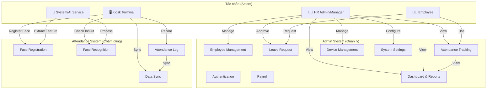

## Biểu đồ Usecase Tổng quát

Hệ thống Employee Management gồm hai hệ thống chính:

**1. Admin System:**
- Quản lý nhân viên, bộ phận, chức vụ
- Quản lý chấm công
- Quản lý đơn xin phép
- Tính lương
- Xem báo cáo
- Cấu hình hệ thống
- Quản lý thiết bị

**2. Attendance System:**
- Đăng ký khuôn mặt
- Nhận diện và chấm công
- Lưu trữ và đồng bộ dữ liệu

**Tác nhân chính:**
- HR Admin: Quản lý toàn bộ hệ thống
- Employee: Sử dụng hệ thống để xem thông tin và chấm công
- Kiosk Terminal: Thiết bị chấm công
- AI System: Xử lý nhận diện khuôn mặt

