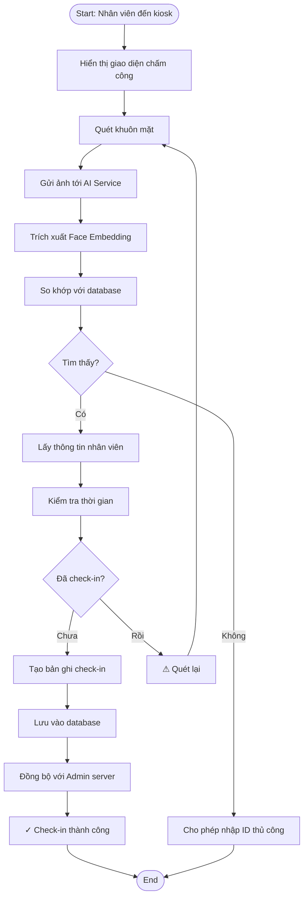
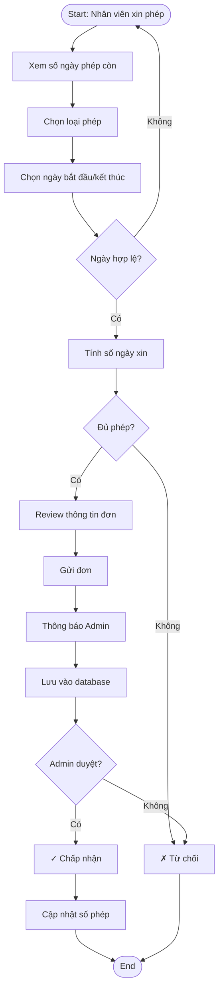
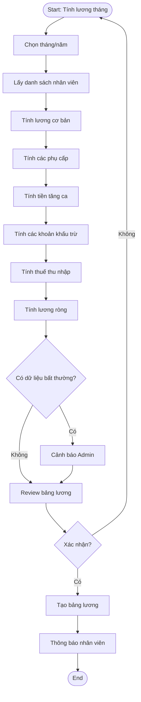
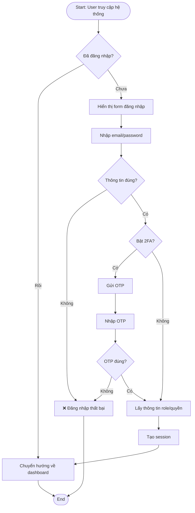

## 4. Biểu đồ Hoạt động (Activity Diagrams)

### A. Activity Diagram: Quy trình Chấm công (Check-in)



---

### B. Activity Diagram: Quy trình Xin Phép



---

### C. Activity Diagram: Quy trình Tính Lương



---

### D. Activity Diagram: Quy trình Đăng ký Khuôn mặt (Face Enrollment)

```mermaid
graph TD
    Start([Start: Đăng ký khuôn mặt])
    Guide["Hướng dẫn vị trí mặt"])
    Scan1["Quét mặt chính diện"]
    Quality1{Chất lượng tốt?}
    Scan2["Quét mặt góc trái"])
    Quality2{Chất lượng tốt?}
    Scan3["Quét mặt góc phải"])
    Quality3{Chất lượng tốt?}
    Extract["Trích xuất Face Embedding"]
    Store["Lưu embedding vào database"]
    Confirm["✓ Đăng ký thành công"]
    Error["⚠ Lỗi, quét lại"]
    End([End])

    Start --> Guide
    Guide --> Scan1
    Scan1 --> Quality1
    
    Quality1 -->|Không| Error
    Quality1 -->|Có| Scan2
    
    Scan2 --> Quality2
    Quality2 -->|Không| Error
    Quality2 -->|Có| Scan3
    
    Scan3 --> Quality3
    Quality3 -->|Không| Error
    Quality3 -->|Có| Extract
    
    Extract --> Store
    Store --> Confirm
    Confirm --> End
    
    Error --> Guide
```

---

### E. Activity Diagram: Quy trình Đăng nhập Hệ thống



