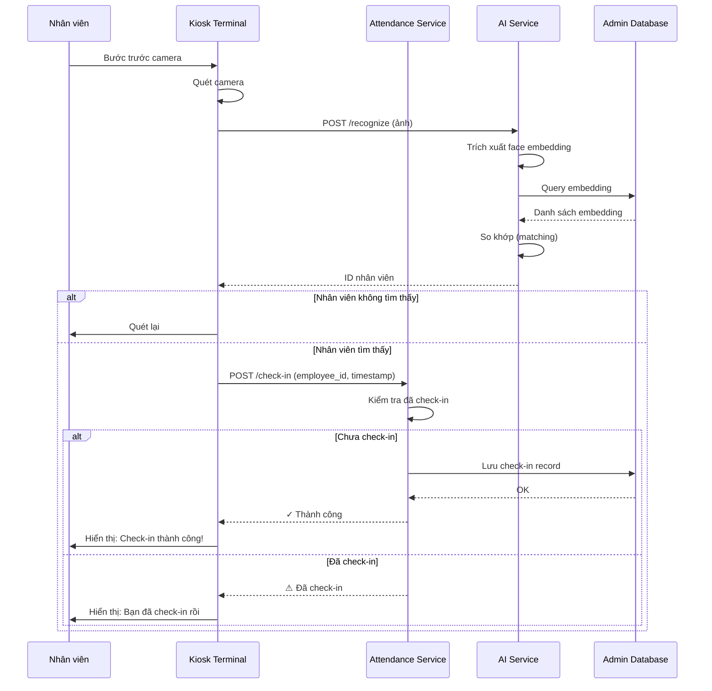
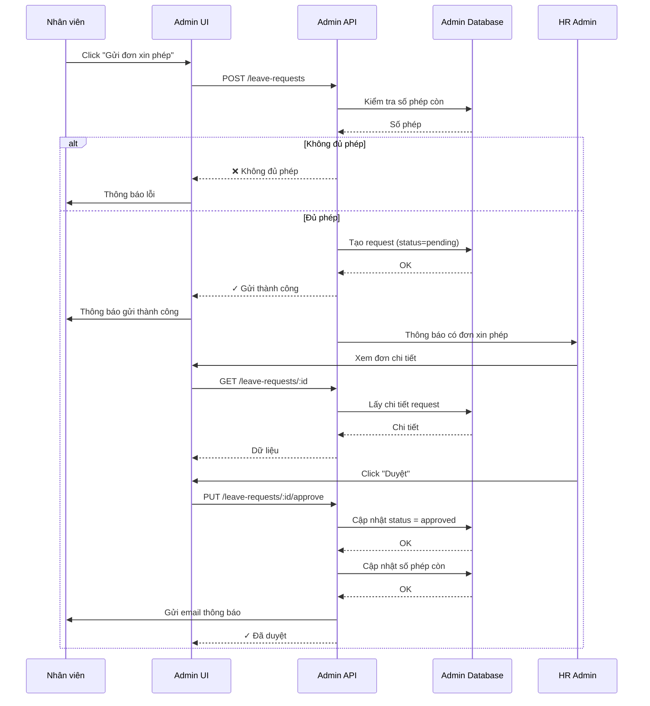
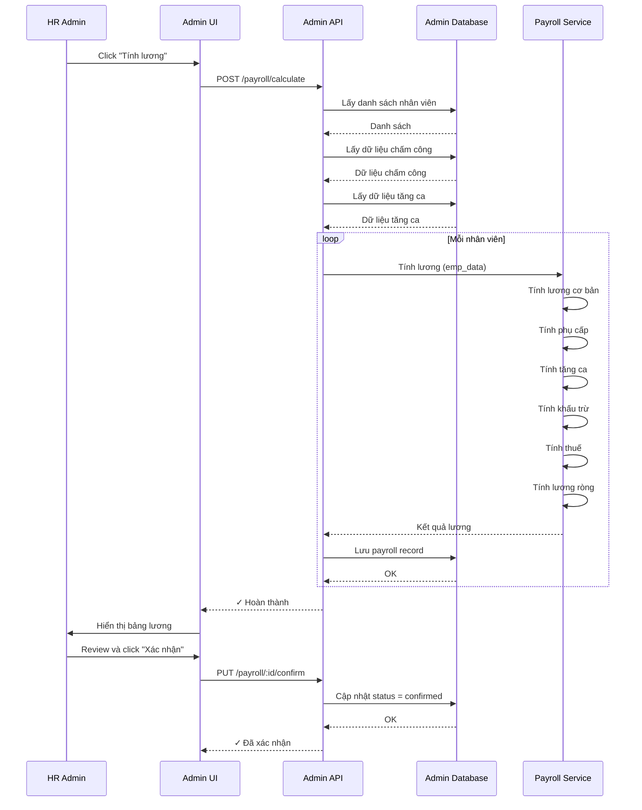
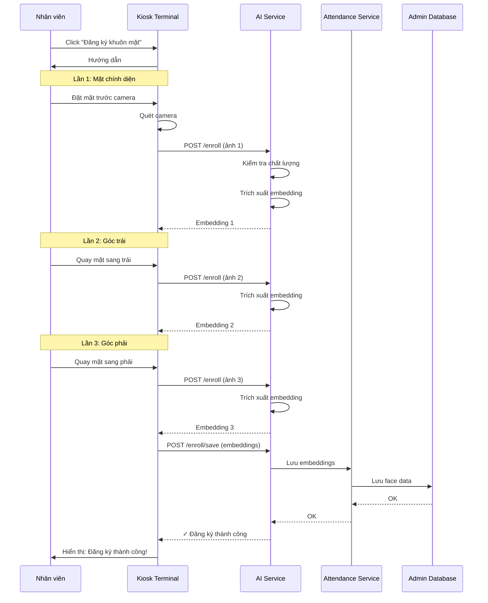
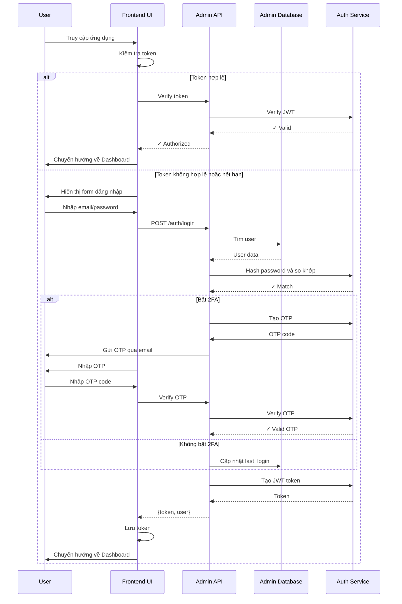

## 5. Biểu đồ Trình tự (Sequence Diagrams)

### A. Sequence Diagram: Check-in bằng Khuôn mặt

---

### B. Sequence Diagram: Xin Phép

---

### C. Sequence Diagram: Tính Lương

---

### D. Sequence Diagram: Đăng ký Khuôn mặt

---

### E. Sequence Diagram: Đăng nhập Hệ thống

