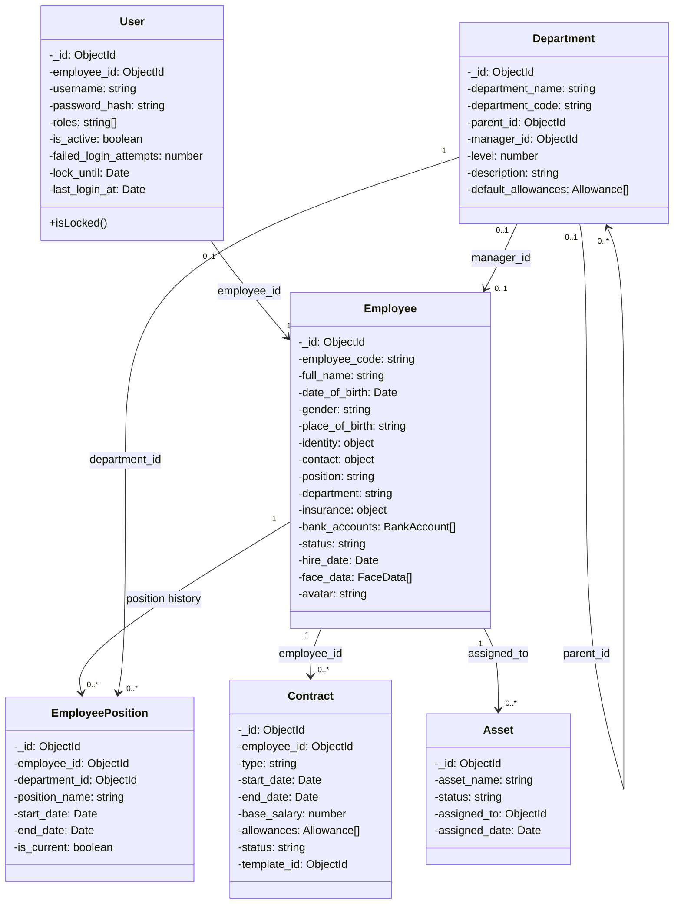
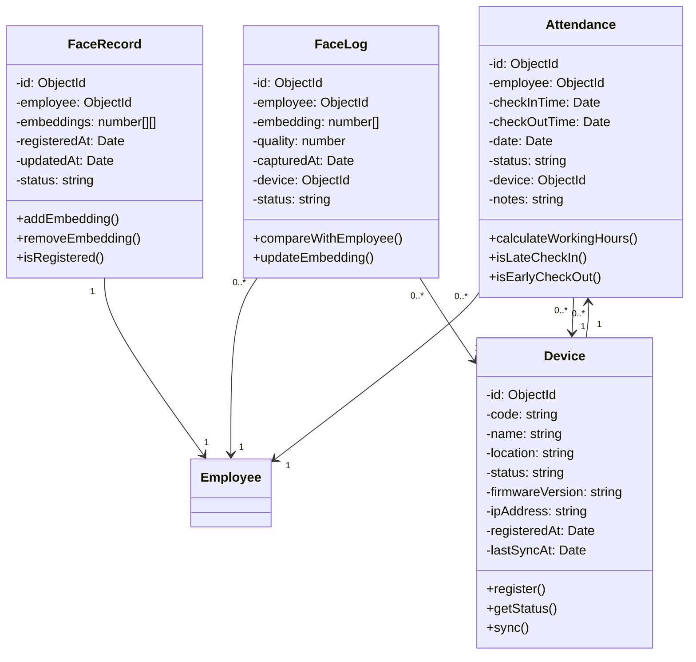
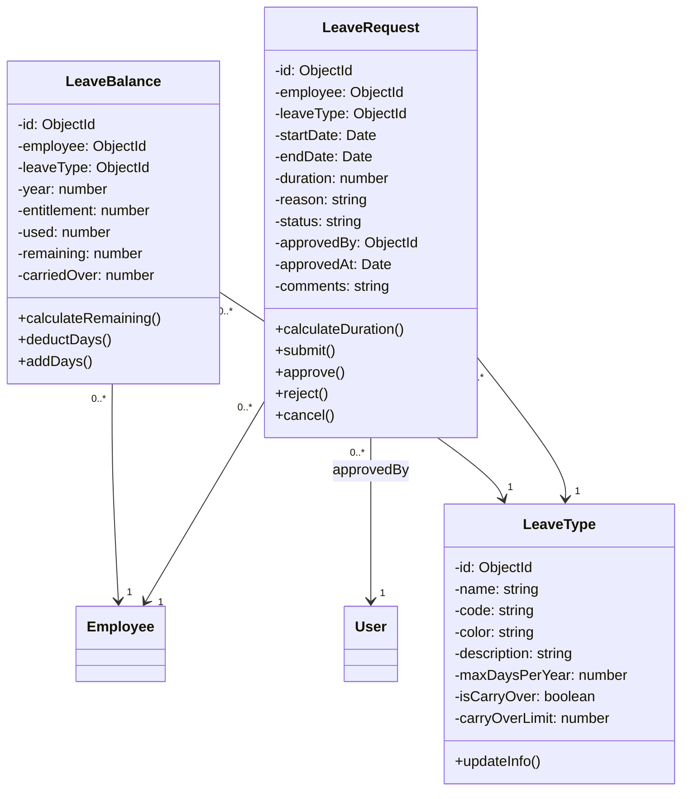
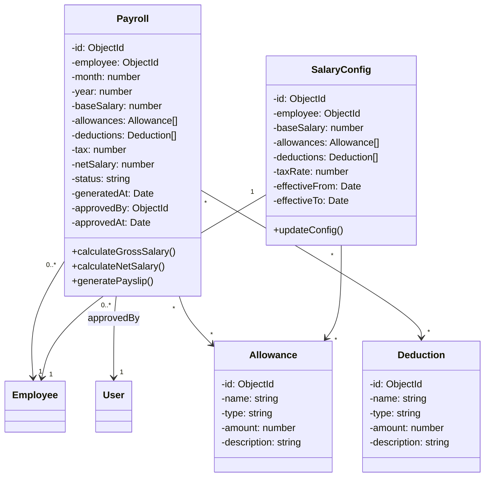
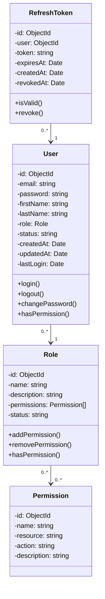
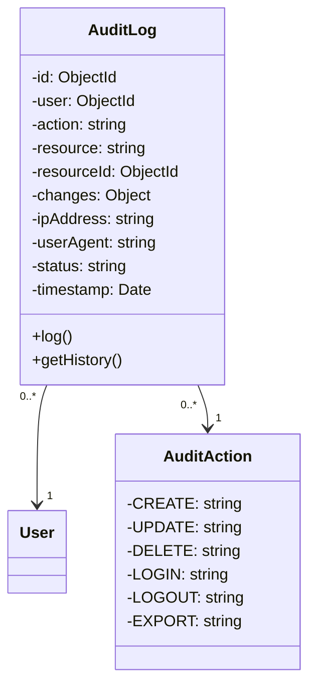

## 6. Biểu đồ Lớp (Class Diagrams)

### A. Class Diagram: Employee Management Module

---

### B. Class Diagram: Attendance Module

---

### C. Class Diagram: Leave Request Module

---

### D. Class Diagram: Payroll Module

---

### E. Class Diagram: Authentication & Authorization

---

### F. Class Diagram: Audit Logging

