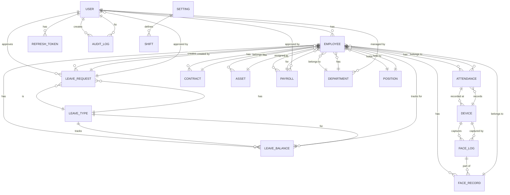

## 7. Biểu đồ ER (Entity-Relationship) - Cơ sở Dữ liệu Quan hệ



---

### Định nghĩa chi tiết các bảng (Tables):

#### 1. **USER** - Người dùng hệ thống
```sql
CREATE TABLE users (
    _id ObjectId PRIMARY KEY,
    email VARCHAR(255) UNIQUE NOT NULL,
    password VARCHAR(255) NOT NULL,
    firstName VARCHAR(100) NOT NULL,
    lastName VARCHAR(100) NOT NULL,
    role ObjectId REFERENCES roles(_id),
    status ENUM('active', 'inactive', 'suspended'),
    createdAt TIMESTAMP,
    updatedAt TIMESTAMP,
    lastLogin TIMESTAMP
);
```

#### 2. **EMPLOYEE** - Nhân viên
```sql
CREATE TABLE employees (
    _id ObjectId PRIMARY KEY,
    firstName VARCHAR(100) NOT NULL,
    lastName VARCHAR(100) NOT NULL,
    email VARCHAR(255) UNIQUE NOT NULL,
    phone VARCHAR(20),
    address TEXT,
    dob DATE,
    gender ENUM('male', 'female', 'other'),
    identityNumber VARCHAR(50) UNIQUE,
    department ObjectId REFERENCES departments(_id),
    position ObjectId REFERENCES positions(_id),
    startDate DATE,
    status ENUM('active', 'inactive', 'terminated'),
    createdAt TIMESTAMP,
    updatedAt TIMESTAMP
);
```

#### 3. **DEPARTMENT** - Bộ phận
```sql
CREATE TABLE departments (
    _id ObjectId PRIMARY KEY,
    name VARCHAR(100) NOT NULL UNIQUE,
    code VARCHAR(50) UNIQUE,
    description TEXT,
    manager ObjectId REFERENCES users(_id),
    budget DECIMAL(15,2),
    createdAt TIMESTAMP,
    updatedAt TIMESTAMP
);
```

#### 4. **POSITION** - Chức vụ
```sql
CREATE TABLE positions (
    _id ObjectId PRIMARY KEY,
    title VARCHAR(100) NOT NULL UNIQUE,
    description TEXT,
    level ENUM('entry', 'junior', 'senior', 'lead', 'manager'),
    salary DECIMAL(15,2),
    responsibilities TEXT[],
    requirements TEXT[],
    createdAt TIMESTAMP,
    updatedAt TIMESTAMP
);
```

#### 5. **CONTRACT** - Hợp đồng lao động
```sql
CREATE TABLE contracts (
    _id ObjectId PRIMARY KEY,
    employee ObjectId REFERENCES employees(_id),
    position ObjectId REFERENCES positions(_id),
    startDate DATE NOT NULL,
    endDate DATE,
    type ENUM('probation', 'fixed-term', 'permanent'),
    status ENUM('active', 'ended', 'terminated'),
    salary DECIMAL(15,2),
    benefits TEXT[],
    createdAt TIMESTAMP,
    updatedAt TIMESTAMP
);
```

#### 6. **ATTENDANCE** - Chấm công
```sql
CREATE TABLE attendances (
    _id ObjectId PRIMARY KEY,
    employee ObjectId REFERENCES employees(_id),
    date DATE NOT NULL,
    checkInTime TIMESTAMP,
    checkOutTime TIMESTAMP,
    device ObjectId REFERENCES devices(_id),
    status ENUM('checked-in', 'checked-out', 'absent', 'late'),
    notes TEXT,
    createdAt TIMESTAMP,
    updatedAt TIMESTAMP,
    UNIQUE(employee, date)
);
```

#### 7. **DEVICE** - Thiết bị kiosk
```sql
CREATE TABLE devices (
    _id ObjectId PRIMARY KEY,
    code VARCHAR(50) UNIQUE NOT NULL,
    name VARCHAR(100) NOT NULL,
    location VARCHAR(255),
    status ENUM('active', 'inactive', 'offline'),
    firmwareVersion VARCHAR(50),
    ipAddress VARCHAR(45),
    registeredAt TIMESTAMP,
    lastSyncAt TIMESTAMP,
    createdAt TIMESTAMP,
    updatedAt TIMESTAMP
);
```

#### 8. **FACE_RECORD** - Bản ghi khuôn mặt (enrollment)
```sql
CREATE TABLE face_records (
    _id ObjectId PRIMARY KEY,
    employee ObjectId REFERENCES employees(_id) UNIQUE,
    embeddings VECTOR[],
    registeredAt TIMESTAMP,
    updatedAt TIMESTAMP,
    status ENUM('active', 'inactive'),
    createdAt TIMESTAMP
);
```

#### 9. **FACE_LOG** - Lịch sử quét khuôn mặt
```sql
CREATE TABLE face_logs (
    _id ObjectId PRIMARY KEY,
    employee ObjectId REFERENCES employees(_id),
    embedding VECTOR NOT NULL,
    quality FLOAT,
    capturedAt TIMESTAMP,
    device ObjectId REFERENCES devices(_id),
    status ENUM('recognized', 'failed', 'duplicate'),
    createdAt TIMESTAMP
);
```

#### 10. **LEAVE_TYPE** - Loại phép
```sql
CREATE TABLE leave_types (
    _id ObjectId PRIMARY KEY,
    name VARCHAR(100) NOT NULL UNIQUE,
    code VARCHAR(50) UNIQUE,
    color VARCHAR(7),
    description TEXT,
    maxDaysPerYear INT,
    isCarryOver BOOLEAN DEFAULT false,
    carryOverLimit INT,
    createdAt TIMESTAMP,
    updatedAt TIMESTAMP
);
```

#### 11. **LEAVE_REQUEST** - Đơn xin phép
```sql
CREATE TABLE leave_requests (
    _id ObjectId PRIMARY KEY,
    employee ObjectId REFERENCES employees(_id),
    leaveType ObjectId REFERENCES leave_types(_id),
    startDate DATE NOT NULL,
    endDate DATE NOT NULL,
    duration INT,
    reason TEXT,
    status ENUM('pending', 'approved', 'rejected', 'cancelled'),
    approvedBy ObjectId REFERENCES users(_id),
    approvedAt TIMESTAMP,
    comments TEXT,
    createdAt TIMESTAMP,
    updatedAt TIMESTAMP
);
```

#### 12. **LEAVE_BALANCE** - Số phép còn lại
```sql
CREATE TABLE leave_balances (
    _id ObjectId PRIMARY KEY,
    employee ObjectId REFERENCES employees(_id),
    leaveType ObjectId REFERENCES leave_types(_id),
    year INT NOT NULL,
    entitlement INT,
    used INT DEFAULT 0,
    remaining INT,
    carriedOver INT DEFAULT 0,
    createdAt TIMESTAMP,
    updatedAt TIMESTAMP,
    UNIQUE(employee, leaveType, year)
);
```

#### 13. **PAYROLL** - Bảng lương
```sql
CREATE TABLE payrolls (
    _id ObjectId PRIMARY KEY,
    employee ObjectId REFERENCES employees(_id),
    month INT NOT NULL,
    year INT NOT NULL,
    baseSalary DECIMAL(15,2),
    grossSalary DECIMAL(15,2),
    tax DECIMAL(15,2),
    deductions DECIMAL(15,2),
    netSalary DECIMAL(15,2),
    status ENUM('draft', 'confirmed', 'paid'),
    approvedBy ObjectId REFERENCES users(_id),
    approvedAt TIMESTAMP,
    paidAt TIMESTAMP,
    createdAt TIMESTAMP,
    updatedAt TIMESTAMP,
    UNIQUE(employee, month, year)
);
```

#### 14. **ASSET** - Tài sản
```sql
CREATE TABLE assets (
    _id ObjectId PRIMARY KEY,
    employee ObjectId REFERENCES employees(_id),
    assetType VARCHAR(100),
    serialNumber VARCHAR(100) UNIQUE,
    issueDate DATE,
    returnDate DATE,
    status ENUM('assigned', 'returned', 'lost'),
    notes TEXT,
    createdAt TIMESTAMP,
    updatedAt TIMESTAMP
);
```

#### 15. **AUDIT_LOG** - Nhật ký kiểm toán
```sql
CREATE TABLE audit_logs (
    _id ObjectId PRIMARY KEY,
    user ObjectId REFERENCES users(_id),
    action VARCHAR(100),
    resource VARCHAR(100),
    resourceId ObjectId,
    changes JSON,
    ipAddress VARCHAR(45),
    userAgent TEXT,
    status ENUM('success', 'failure'),
    timestamp TIMESTAMP
);
```

#### 16. **REFRESH_TOKEN** - Token làm mới
```sql
CREATE TABLE refresh_tokens (
    _id ObjectId PRIMARY KEY,
    user ObjectId REFERENCES users(_id),
    token TEXT UNIQUE NOT NULL,
    expiresAt TIMESTAMP,
    revokedAt TIMESTAMP,
    createdAt TIMESTAMP
);
```

#### 17. **SETTING** - Cấu hình hệ thống
```sql
CREATE TABLE settings (
    _id ObjectId PRIMARY KEY,
    key VARCHAR(100) UNIQUE NOT NULL,
    value TEXT,
    description TEXT,
    type ENUM('string', 'number', 'boolean', 'json'),
    updatedAt TIMESTAMP
);
```

#### 18. **SHIFT** - Ca làm việc
```sql
CREATE TABLE shifts (
    _id ObjectId PRIMARY KEY,
    name VARCHAR(100) NOT NULL,
    startTime TIME,
    endTime TIME,
    workingHours INT,
    description TEXT,
    createdAt TIMESTAMP,
    updatedAt TIMESTAMP
);
```

