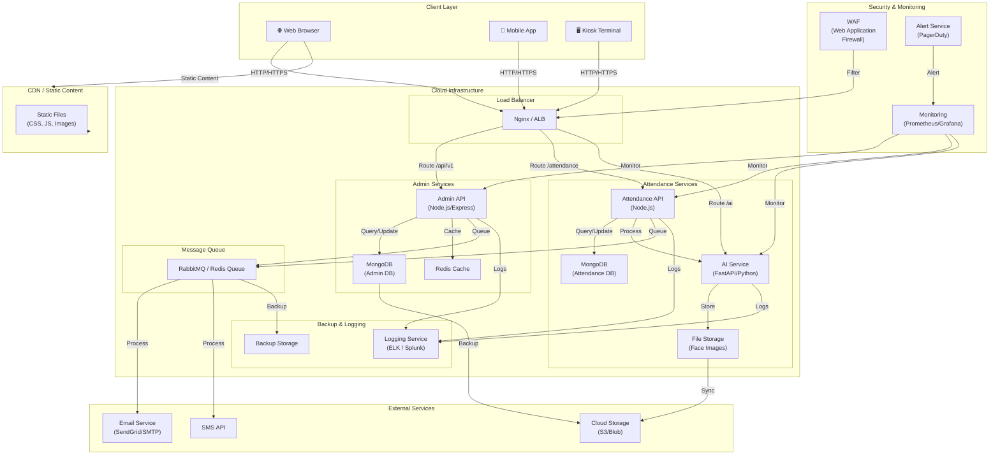

## 8. Biểu đồ Triển khai (Deployment Diagram)



---

### Mô tả các thành phần triển khai:

#### **Client Layer (Lớp Client)**
- **Web Browser**: Admin website (React 19 + Vite)
- **Mobile App**: Kiosk terminal (Expo/React Native)
- **Kiosk Terminal**: Thiết bị chấm công tại công ty

#### **CDN (Content Delivery Network)**
- Lưu trữ và phân phối các file tĩnh (CSS, JavaScript, Images)
- Tăng tốc độ tải trang
- Giảm tải cho API servers

#### **Load Balancer (Nginx/AWS ALB)**
- Phân tải yêu cầu đến các server API
- Kiểm tra sức khỏe các server
- SSL/TLS termination

#### **Admin Services (Dịch vụ Quản lý)**
- **Admin API**: Node.js/Express server xử lý quản lý nhân viên, lương, báo cáo
- **MongoDB**: Cơ sở dữ liệu lưu trữ dữ liệu quản lý
- **Redis Cache**: Cache để tăng tốc độ truy vấn

#### **Attendance Services (Dịch vụ Chấm công)**
- **Attendance API**: Node.js server xử lý chấm công
- **MongoDB**: Cơ sở dữ liệu chấm công
- **AI Service**: FastAPI (Python) xử lý nhận diện khuôn mặt
- **File Storage**: Lưu trữ ảnh khuôn mặt

#### **Message Queue (Hàng đợi Tin nhắn)**
- **RabbitMQ/Redis**: Xử lý các tác vụ không đồng bộ
- Gửi email
- Gửi SMS
- Sao lưu dữ liệu

#### **Backup & Logging**
- **Backup Storage**: Sao lưu định kỳ cơ sở dữ liệu
- **Logging Service**: ELK Stack hoặc Splunk để centralize logs

#### **External Services**
- **Email Service**: SendGrid/SMTP để gửi email
- **SMS API**: Gửi tin nhắn SMS
- **Cloud Storage**: AWS S3/Azure Blob để lưu trữ ảnh, backup

#### **Security & Monitoring**
- **WAF**: Bảo vệ chống các cuộc tấn công web phổ biến
- **Monitoring**: Prometheus/Grafana theo dõi hiệu năng
- **Alert Service**: PagerDuty, Slack để thông báo sự cố

---

### Kiến trúc Deployment chi tiết:

```
┌─────────────────────────────────────────────────────────────┐
│                    Internet / Users                          │
└────────────────┬────────────────────────────────────────────┘
                 │
        ┌────────▼─────────┐
        │   WAF / DDoS      │
        │   Protection      │
        └────────┬──────────┘
                 │
        ┌────────▼──────────┐
        │  Load Balancer    │
        │  (Nginx/ALB)      │
        └─┬─────────────┬───┘
          │             │
    ┌─────▼──────┐  ┌──▼────────┐
    │  Pod 1     │  │  Pod 2    │
    │ - API      │  │ - API     │
    │ - Worker   │  │ - Worker  │
    └─────┬──────┘  └──┬────────┘
          │            │
    ┌─────▼────────────▼──────┐
    │   Data Layer            │
    │ - MongoDB (Admin)       │
    │ - MongoDB (Attendance)  │
    │ - Redis Cache           │
    │ - File Storage          │
    └─────────────────────────┘
```

---

### Deployment Strategy:

#### **Development Environment**
- Local machine hoặc Docker Compose
- Database: MongoDB local
- All services run locally

#### **Staging Environment**
- Cloud VMs hoặc Kubernetes cluster
- Database: Separate MongoDB instances
- Full monitoring & logging enabled
- Pre-production testing

#### **Production Environment**
- Kubernetes cluster (GKE, EKS, AKS)
- Database: Managed MongoDB (Atlas, DocumentDB)
- Multi-replica databases for high availability
- Full monitoring, logging, and alerting
- Auto-scaling based on load
- CDN for static content
- Backup strategy: Daily automated backups

---

### High Availability & Disaster Recovery:

```
┌────────────────────┐
│ Primary Region     │
├────────────────────┤
│ - Admin Cluster    │
│ - Attendance API   │
│ - MongoDB Primary  │
│ - AI Service       │
└────────────────────┘
         │
    ┌────▼─────────┐ ┌──────────────────┐
    │ Replication  │─│ Secondary Region │
    │              │ ├──────────────────┤
    └──────────────┘ │ - Standby API    │
                     │ - MongoDB Replica│
                     │ - Failover ready │
                     └──────────────────┘

Backup Strategy:
- Daily full backup
- Hourly incremental backup
- 30-day retention
- Geo-redundant storage
```

