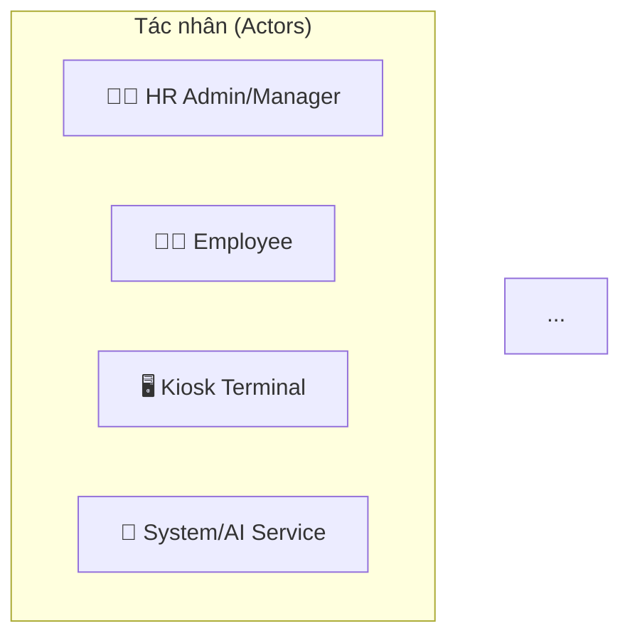

## Hướng dẫn Xuất Biểu đồ sang Draw.io

### 📌 Cách nhanh nhất: Sử dụng Mermaid Live Editor

#### Step 1: Truy cập Mermaid Live
```
URL: https://mermaid.live
```

#### Step 2: Copy mermaid code
Ví dụ từ file `02-usecase-tong-quat.md`:


#### Step 3: Dán vào Mermaid Live Editor
- Copy toàn bộ mermaid code (từ ```mermaid đến ```)
- Dán vào bên trái của mermaid.live
- Biểu đồ sẽ render tự động bên phải

#### Step 4: Export sang SVG/PNG
**Options trong Mermaid Live:**
- 📥 **Download SVG** - Export vector format (best for editing)
- 📥 **Download PNG** - Export raster format
- 📥 **Download PDF** - Cho printing

---

### 🎨 Cách chuyên nghiệp: Sử dụng Draw.io Desktop

#### Step 1: Cài đặt Draw.io Desktop
```bash
# Windows (PowerShell)
choco install drawio

# Hoặc tải từ: https://drawio-app.com/download
```

#### Step 2: Mở Draw.io
```
File → New → Create (or Ctrl+N)
```

#### Step 3: Copy Mermaid từ Markdown
```
Mở file markdown (ví dụ: 02-usecase-tong-quat.md)
Copy đoạn code từ ```mermaid đến ```
```

#### Step 4: Import vào Draw.io (2 cách)

**Cách A: Sử dụng Extensions (nếu có)**
```
File → Import from → URL/Paste
Paste mermaid code
```

**Cách B: Vẽ thủ công (nếu import không hoạt động)**
```
1. Draw.io → More shapes → Search "Use case"
2. Kéo thả actors (người dùng)
3. Kéo thả use cases (ellipse)
4. Vẽ mối quan hệ (arrow)
5. Format như mermaid code
```

#### Step 5: Save as Draw.io Format
```
File → Save as
Format: .drawio (Draw.io XML format)
Location: uml-diagrams/drawio/

Ví dụ: usecase-tong-quat.drawio
```

#### Step 6: Export sang PNG/SVG/PDF
```
File → Export as
Chọn:
  - PNG (Raster, tốt cho presentation)
  - SVG (Vector, tốt cho web)
  - PDF (Tốt cho in)

Save vào: uml-diagrams/images/
```

---

### ⚡ Cách tự động: Sử dụng Mermaid CLI

#### Step 1: Cài đặt Mermaid CLI
```bash
npm install -g @mermaid-js/mermaid-cli
```

#### Step 2: Chuyển đổi từ Markdown sang SVG/PNG
```bash
# Vào thư mục uml-diagrams
cd uml-diagrams

# Chuyển đổi một file
mmdc -i 02-usecase-tong-quat.md -o images/usecase-tong-quat.svg

# Chuyển đổi tất cả file
for file in *.md; do
  mmdc -i "$file" -o "images/${file%.md}.svg"
done
```

#### Step 3: Hoặc sử dụng Python script
```bash
cd uml-diagrams
python3 convert-to-svg.py
```

---

### 🔧 Cách để các file .drawio hoạt động tốt nhất:

#### 1. **Đổi tên biểu đồ để rõ ràng**
```
Xấu: diagram1.drawio
Tốt: 02-usecase-tong-quat.drawio
Tốt hơn: 02-usecase-tong-quat-chi-tiet.drawio
```

#### 2. **Sử dụng các shape phù hợp**
```
Use Case: Actor (người), Use Case (ellipse)
Class Diagram: Rectangle (class), Diamond (interface)
Sequence: Lifeline (dòng thẳng), Message (arrow)
Activity: Circle (start/end), Rectangle (activity), Diamond (decision)
```

#### 3. **Áp dụng styling**
```
Colors: 
  - Admin: Blue
  - Employee: Green
  - System: Red
  - External: Yellow

Font: Arial, 12px
Line width: 2px
```

#### 4. **Lưu metadata**
```
Draw.io → File Properties
Thêm:
  - Author: [Your Name]
  - Description: [Purpose]
  - Version: 1.0
```

---

### 📦 Cấu trúc thư mục sau hoàn thành:

```
uml-diagrams/
├── *.md                          # Mermaid markdown files
├── convert-to-svg.py             # Script chuyển đổi
├── EXPORT_GUIDE.md               # File này
├── README.md                     # Tóm tắt
│
├── drawio/                       # Thư mục Draw.io files
│   ├── 02-usecase-tong-quat.drawio
│   ├── 03-usecase-chi-tiet.drawio
│   ├── 04-activity-diagram.drawio
│   ├── 05-sequence-diagram.drawio
│   ├── 06-class-diagram.drawio
│   ├── 07-er-diagram.drawio
│   └── 08-deployment-diagram.drawio
│
└── images/                       # Thư mục ảnh PNG/SVG
    ├── 02-usecase-tong-quat.svg
    ├── 02-usecase-tong-quat.png
    ├── 03-usecase-chi-tiet.svg
    ├── 04-activity-diagram.svg
    ├── 05-sequence-diagram.svg
    ├── 06-class-diagram.svg
    ├── 07-er-diagram.svg
    └── 08-deployment-diagram.svg
```

---

### 🎯 Sử dụng các biểu đồ trong tài liệu:

#### Markdown:
```markdown
## Biểu đồ Usecase


**Mô tả:** Hệ thống gồm 2 module chính...
```

#### PowerPoint/Google Slides:
```
Insert → Image → Chọn SVG từ thư mục images/
```

#### HTML:
```html

```

#### PDF (cho báo cáo):
```
File → Export as → PDF
Đặt: 5 file ảnh SVG vào PDF
```

---

### ✅ Checklist hoàn thành:

- [ ] Cài đặt Draw.io Desktop hoặc sử dụng Online
- [ ] Copy Mermaid code từ các file markdown
- [ ] Import/vẽ biểu đồ trong Draw.io
- [ ] Format và styling biểu đồ
- [ ] Save as .drawio format
- [ ] Export sang PNG/SVG
- [ ] Lưu vào thư mục `drawio/` và `images/`
- [ ] Kiểm tra chất lượng hình ảnh
- [ ] Sử dụng trong tài liệu/báo cáo

---

### 🚀 Quick Start Command:

Cho những ai thích dòng lệnh:

```bash
# 1. Cài đặt tools
npm install -g @mermaid-js/mermaid-cli

# 2. Vào thư mục
cd uml-diagrams

# 3. Chuyển đổi tất cả
for file in 0[2-8]-*.md; do
  mmdc -i "$file" -o "images/${file%.md}.svg" -w 1200 -H 800
done

# 4. Kiểm tra kết quả
ls -lh images/
```

---

### 💡 Tips:

1. **SVG tốt hơn PNG** vì có thể zoom không mất chất lượng
2. **Draw.io format (.drawio)** dễ nhất để edit sau
3. **Mermaid markdown** dễ nhất để version control (git)
4. Kết hợp cả 3 format cho tối ưu (markdown → draw.io → png/svg)

---

### 🆘 Troubleshooting:

**Q: Mermaid CLI không cài được**
```bash
A: npm install -g @mermaid-js/mermaid-cli
   # Nếu còn lỗi, cài global mermaid trước:
   npm install -g mermaid
```

**Q: Draw.io không mở được file .drawio**
```bash
A: Chắc chắn đã tải bản desktop từ https://drawio-app.com/
   Version online không hỗ trợ import file local
```

**Q: Hình ảnh PNG bị mờ**
```bash
A: Dùng flag -s để zoom khi export:
   mmdc -i file.md -o file.png -s 2
```

---

**Bây giờ bạn đã sẵn sàng xuất toàn bộ biểu đồ sang Draw.io! 🎉**

